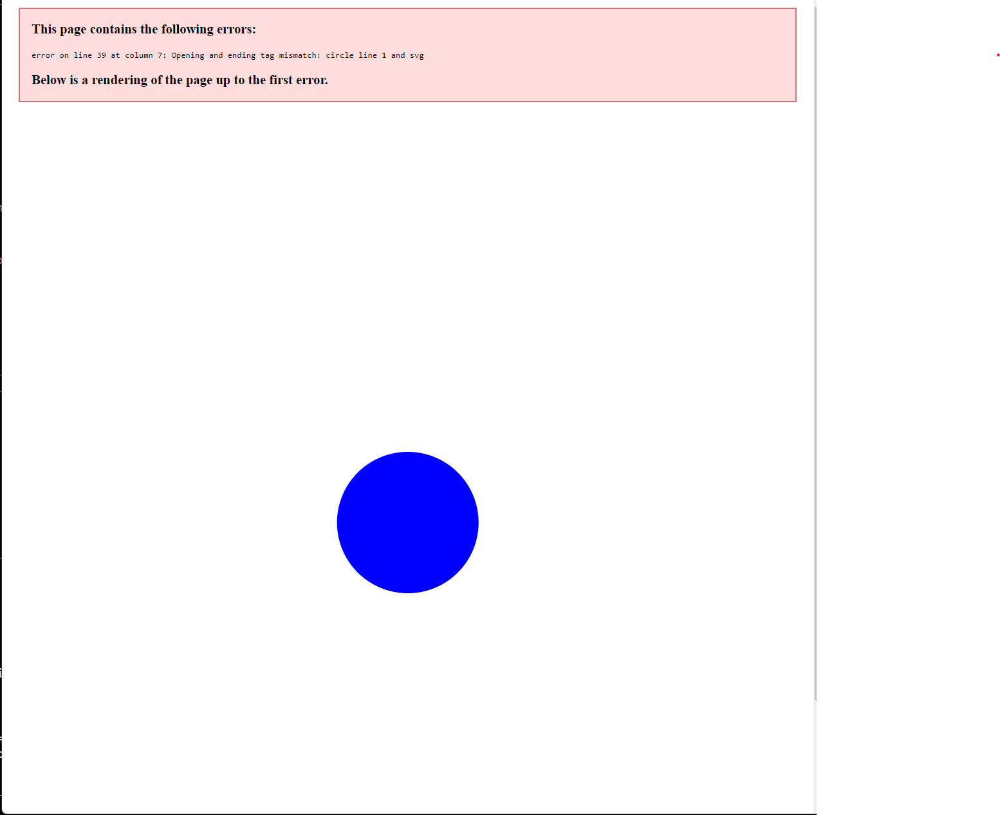

# svg-logo-maker

## Description

This application generates a logo that contains up to three characters within one of three available shapes (circle, square, triangle)

## Link to demo
https://drive.google.com/file/d/16Xrx1nkBp1zphFlCb-pfNZECbzLojkrx/view

## Screenshot

## License
